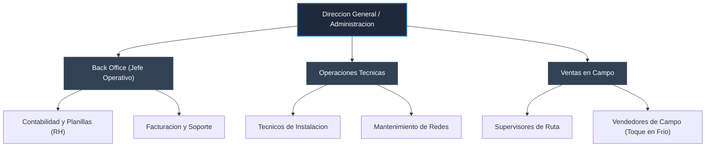

# Estructura Organizacional de COMSERTEL

Este documento detalla la estructura organizativa de la empresa COMSERTEL como parte de los requisitos de control interno y reglas de negocio del sistema de recursos humanos. La organizacion cuenta con departamentos especificos para las operaciones y administracion, asegurando la correcta segregacion de funciones.

---

## 1. Departamentos y Distribucion del Personal

La empresa cuenta actualmente con tres departamentos clave, diseñados para garantizar la cobertura operativa de ventas, soporte tecnico y administracion central:

1. **Ventas en Campo:**
   * **Descripcion:** Encargado de la adquisicion de clientes directamente en el territorio de operaciones.
   * **Puesto Clave:** Vendedor Toque en Frio.
   * **Cantidad Estimada de Empleados:** 8 colaboradores.

2. **Operaciones Tecnicas:**
   * **Descripcion:** Responsable de la instalacion fisica, mantenimiento de redes, soporte tecnologico y atencion a fallas en el servicio.
   * **Puesto Clave:** Tecnico de Instalacion.
   * **Cantidad Estimada de Empleados:** 4 colaboradores.

3. **Back Office:**
   * **Descripcion:** Proporciona soporte administrativo, control contable, facturacion, gestion de recursos humanos y gestion operativa del negocio.
   * **Puesto Clave:** Jefe Operativo.
   * **Cantidad Estimada de Empleados:** 2 colaboradores.

* **Total de Personal Activo:** 14 empleados.
Este total de colaboradores es fundamental para las reglas de negocio del sistema, ya que al superar los 10 empleados de planilla en el sector privado, la empresa esta sujeta por ley al aporte del 1% en concepto de INCAF (Instituto Nacional de Capacitacion y Formacion), de acuerdo con el Decreto N. 893.

---

## 2. Clasificacion de Puestos de Trabajo y Salarios Base

El sistema de planillas de COMSERTEL valida que cada puesto de trabajo (cargo) posea un salario base preestablecido acorde a sus responsabilidades, cumpliendo rigurosamente con el salario minimo de ley vigente en El Salvador ($365.00 USD para el sector comercio, servicios e industria):

| ID Cargo | Puesto de Trabajo | Departamento | Salario Base Mensual | Cumple Salario Minimo |
| :--- | :--- | :--- | :--- | :--- |
| 1 | Vendedor Toque en Frio | Ventas en Campo | $365.00 USD | Si (Salario Minimo Legal) |
| 2 | Tecnico de Instalacion | Operaciones Tecnicas | $450.00 USD | Si |
| 3 | Jefe Operativo | Back Office | $800.00 USD | Si |

---

## 3. Organigrama Funcional de la Empresa

El siguiente diagrama detalla la jerarquia y relacion administrativa de COMSERTEL, desde la gerencia general hasta las areas de campo:

---

## 4. Segregacion de Roles en el Sistema

El acceso al aplicativo del sistema de recursos humanos y planillas se controla a traves de roles diferenciados para evitar conflictos de interes en la manipulacion de datos financieros:

1. **Rol Administrador:**
   * Tiene control total del sistema.
   * Modifica cargos y salarios base (verificando el salario minimo de $365.00 USD).
   * Registra empleados y aprueba ausencias o incapacidades de forma oficial.
   * Genera, recalcula y efectua el cierre definitivo de las planillas.

2. **Rol Operador / Consultor (Visualizador):**
   * Accede al sistema para consultas generales.
   * Visualiza las planillas procesadas y las boletas de pago de los empleados.
   * No puede crear cargos, alterar salarios, aprobar ausencias ni cerrar periodos financieros.
