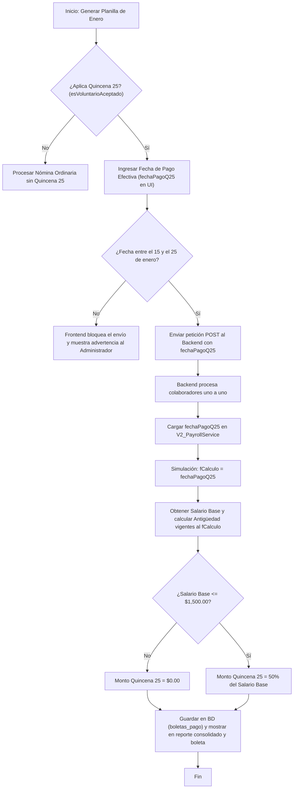

# Simulación y Proceso de Cálculo de la Quincena Veinticinco

Este documento explica en detalle la lógica de negocio y arquitectura implementada para la liquidación del beneficio de la Quincena Veinticinco (Decreto No. 499), detallando cómo el sistema calcula la antigüedad y el salario base de manera consistente utilizando una fecha de pago efectiva ingresada manualmente.

---

## 1. Concepto de Simulación de Fecha de Pago

De acuerdo con el Decreto No. 499 de El Salvador, el beneficio de la Quincena Veinticinco debe ser liquidado y pagado **entre el 15 y el 25 de enero** de cada año. 

Dado que el procesamiento de las planillas ordinarias (mensuales o de segunda quincena) se realiza habitualmente a fin de mes (el **31 de enero**), procesar el beneficio directamente con la fecha de corte del período mensual alteraría el cálculo de las condiciones de los empleados. 

Para solucionar esto, el sistema implementa la **selección manual de la fecha de pago efectiva** (Alternativa A):
1. El administrador ingresa una fecha dentro de la ventana legal (**15 al 25 de enero**) desde el formulario en la interfaz de usuario.
2. Al ejecutar el procesamiento masivo de nómina, el sistema evalúa a cada empleado cargando sus datos contractuales (salario base nominal y fecha de ingreso) vigentes **exactamente a esa fecha ingresada**, y no a la fecha fin de período de la planilla.

### Ejemplo de Impacto en Datos Contractuales:
* **Salario Nominal:** Si un empleado gana $1,000.00 y tiene programado un aumento a $1,200.00 efectivo a partir del 28 de enero. Al ingresar el 25 de enero como fecha efectiva de pago, el sistema calcula el beneficio basándose en el sueldo al 25 de enero ($1,000.00 * 50% = $500.00) en lugar del sueldo a fin de mes ($1,200.00 * 50% = $600.00), cumpliendo estrictamente la ley.
* **Antigüedad (Elegibilidad):** Si un colaborador es dado de baja o presenta cambios en su contrato entre el 26 y el 31 de enero, su elegibilidad al beneficio ordinario se evalúa tomando como punto de control la fecha de pago especificada (ej. 25 de enero).

---

## 2. Flujograma del Proceso (Mermaid)

El siguiente flujograma ilustra cómo interactúan el frontend, el backend y el motor de nómina para liquidar la Quincena Veinticinco con la fecha de pago ingresada:

---

## 3. Implementación en Código

### Frontend:
En [V2_ContenedorPlanilla.jsx](file:///home/bladimir/Documentos/02%20PROYECTOS/Proyecto%20RHU/rrhhu-comsertel/frontend/app-react/src/components/V2_ContenedorPlanilla.jsx), al seleccionar el mes de enero (`2026-01` en adelante) y habilitar la opción de aplicar el beneficio, se activa el control de tipo `date` restringido por las propiedades `min="2026-01-15"` y `max="2026-01-25"`. El valor se envía al backend como `fechaPagoQ25`.

### Backend:
El método `calcularQuincenaVeinticinco` del archivo [v2_payrollService.js](file:///home/bladimir/Documentos/02%20PROYECTOS/Proyecto%20RHU/rrhhu-comsertel/backend/services/v2_payrollService.js) recibe `fechaPagoQ25` e inicializa el cálculo ordinario usándolo como fecha base de cálculo (`fCalculo`). Esto asegura que el día sea válido para la condición `dia >= 15 && dia <= 25` definida en el motor y calcule el 50% correspondiente del salario.
