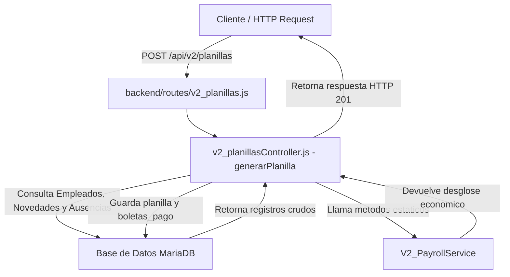
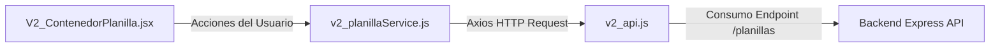

# Documentacion de V2_PayrollService

Este documento detalla el proposito, funcionamiento, metodos e integracion del servicio de calculo de planilla y nomina [v2_payrollService.js](backend/services/v2_payrollService.js) Entro de la aplicacion RRHHU Comsertel.

---

## 1. Proposito del Servicio

El archivo [v2_payrollService.js]() actua como el motor de calculo financiero y fiscal del area de recursos humanos de la empresa. Su funcion primordial es procesar las reglas de negocio legales y corporativas de El Salvador vigentes para el periodo 2025-2026.

Este servicio es puramente logico (stateless), lo que significa que no realiza consultas directas a la base de datos ni maneja estados persistentes; recibe datos crudos, aplica formulas matematico-legales y retorna resultados desglosados listos para ser guardados en la base de datos o presentados al usuario.

---

## 2. Metodos y Funciones

El servicio expone una clase llamada `V2_PayrollService` con multiples metodos estaticos:

### 2.1 parseFechaSinTimezone(f)
* **Proposito:** Normaliza cualquier representacion de fecha (objeto `Date` o cadena de texto) a un objeto `Date` local con horas en cero (00:00:00) para evitar que diferencias horarias y zonas horarias alteren los dias calculados.
* **Parametros:**
  * `f` (Date | string): La fecha a parsear.
* **Retorna:** Un nuevo objeto `Date` sin desajustes horarias de servidor.

### 2.2 calcularDescuentoAusencias(salarioBase, ausencias, fechaInicioPeriodo, fechaFinPeriodo)
* **Proposito:** Determina el numero de dias de ausencias injustificadas aprobadas que se traslapan con el periodo actual y calcula su correspondiente descuento salarial.
* **Parametros:**
  * `salarioBase` (number): Salario mensual base del empleado.
  * `ausencias` (Array): Arreglo de objetos de ausencias registradas para el empleado.
  * `fechaInicioPeriodo` (Date | string): Fecha inicial del rango de la planilla.
  * `fechaFinPeriodo` (Date | string): Fecha final del rango de la planilla.
* **Formulas:**
  * `salarioDia = salarioBase / 30.0`
  * Si la ausencia es de tipo `AUSENCIA_INJUSTIFICADA` y tiene el estado `APROBADA`, se evalua el traslape en dias con el periodo.
* **Retorna:**
  ```json
  {
    "diasAusencia": 2,
    "descuento": 40.00
  }
  ```

### 2.3 calcularAFP(salarioDevengado)
* **Proposito:** Calcula el aporte de la Administradora de Fondos de Pensiones (AFP) tanto del empleado como del patrono.
* **Parametros:**
  * `salarioDevengado` (number): Salario gravable sobre el cual se cotiza.
* **Reglas de Negocio:**
  * Techo AFP mensual: $7,028.29 USD.
  * Tasa Empleado: 7.25% (0.0725).
  * Tasa Patrono: 8.75% (0.0875).
* **Retorna:**
  ```json
  {
    "empleado": 72.50,
    "patrono": 87.50
  }
  ```

### 2.4 calcularISSS(salarioDevengado)
* **Proposito:** Calcula la cotizacion para el Instituto Salvadoreno del Seguro Social (ISSS) del empleado y del patrono.
* **Parametros:**
  * `salarioDevengado` (number): Salario gravable sobre el cual se cotiza.
* **Reglas de Negocio:**
  * Techo ISSS mensual: $1,000.00 USD.
  * Tasa Empleado: 3.00% (0.0300).
  * Tasa Patrono: 7.50% (0.0750).
* **Retorna:**
  ```json
  {
    "empleado": 30.00,
    "patrono": 75.00
  }
  ```

### 2.5 calcularINCAF(salarioDevengado, esSectorAgropecuario, esTemporalAgricola)
* **Proposito:** Calcula el aporte patronal al Instituto de Capacitacion y Formacion (INCAF, antes INSAFORP) segun el Decreto N. 893.
* **Parametros:**
  * `salarioDevengado` (number): Salario gravable sobre el cual se cotiza.
  * `esSectorAgropecuario` (boolean, opcional): Indica si pertenece a este sector (por defecto false).
  * `esTemporalAgricola` (boolean, opcional): Indica si es trabajador temporal (por defecto false).
* **Reglas de Negocio:**
  * Si es sector agropecuario y temporal agricola, esta exento (retorna 0.00).
  * Techo INCAF mensual: $1,000.00 USD.
  * Tasa General: 1.00% (0.0100).
  * Tasa Agropecuaria: 0.25% (0.0025).
* **Retorna:** Un valor numerico (number) redondeado a dos decimales.

### 2.6 calcularISR(salarioDevengado, afpEmpleado, isssEmpleado, tipoPeriodo)
* **Proposito:** Calcula el Impuesto sobre la Renta (ISR) para el ano fiscal 2025-2026.
* **Parametros:**
  * `salarioDevengado` (number): Salario devengado gravado.
  * `afpEmpleado` (number): Deduccion de AFP calculada previamente.
  * `isssEmpleado` (number): Deduccion de ISSS calculada previamente.
  * `tipoPeriodo` (string, opcional): Frecuencia de pago ('MENSUAL' o 'QUINCENAL').
* **Reglas de Negocio:**
  * `Base Gravada = Salario Devengado - AFP Empleado - ISSS Empleado`
  * Regla Especial del Tramo II (Deduccion fija de $1,600 anuales para ingresos <= $9,100 anuales). Se resta proporcionalmente de la base gravada si el ingreso proyectado anual no excede los $9,100.00.
  * Se aplican tablas de retencion progresivas para los periodos Quincenales y Mensuales (Tramos I, II, III y IV).
* **Retorna:** El monto de retencion de renta calculada (number) redondeado a dos decimales.

### 2.7 calcularVacaciones(salarioBase, cumpleAnioContinuo, diasTrabajadosEnAnio)
* **Proposito:** Determina la prima y compensacion por vacaciones ordinarias o proporcionales (Art. 177 Codigo de Trabajo de El Salvador).
* **Parametros:**
  * `salarioBase` (number): Salario base del empleado.
  * `cumpleAnioContinuo` (boolean): Si cumple el ano de servicio completo.
  * `diasTrabajadosEnAnio` (number, opcional): Dias laborados si es proporcional (por defecto 365).
* **Formulas:**
  * Vacacion completa (1 ano): 15 dias de salario base mas prima del 30% (`(salarioBase / 2) * 1.30`).
  * Proporcional: Se calcula los dias proporcionales y sobre ellos se aplica el valor diario mas el 30%.
* **Retorna:** Monto economico a pagar (number) por vacaciones.

### 2.8 calcularAguinaldo(salarioBase, fechaIngreso, fechaCalculo)
* **Proposito:** Calcula el aguinaldo anual segun la antiguedad del trabajador (Art. 196-198 Codigo de Trabajo de El Salvador).
* **Parametros:**
  * `salarioBase` (number): Salario mensual base.
  * `fechaIngreso` (Date | string): Fecha en que entro a laborar.
  * `fechaCalculo` (Date | string, opcional): Fecha en que se calcula (por defecto la fecha actual).
* **Escala Legal de Aguinaldo:**
  * Menos de 1 ano de servicio: Proporcional a los dias laborados usando como base 15 dias de salario.
  * De 1 a menos de 3 anos de servicio: Equivalente a 15 dias de salario.
  * De 3 a menos de 10 anos de servicio: Equivalente a 19 dias de salario.
  * De 10 o mas anos de servicio: Equivalente a 21 dias de salario.
* **Retorna:** El monto total a pagar (number).

### 2.9 calcularQuincenaVeinticinco(salarioBase, fechaCalculo, fechaIngreso, esVoluntarioAceptado, esSectorPublico, esFiniquito)
* **Proposito:** Implementa el calculo de la prestacion de la "Quincena Veinticinco" del Decreto No. 499 de El Salvador.
* **Parametros:**
  * `salarioBase` (number): Salario nominal.
  * `fechaCalculo` (Date | string): Fecha del calculo de planilla.
  * `fechaIngreso` (Date | string): Fecha de ingreso del empleado.
  * `esVoluntarioAceptado` (boolean, opcional): Si la entidad privada voluntariamente se acoge en 2026.
  * `esSectorPublico` (boolean, opcional): Determina obligatoriedad para 2026.
  * `esFiniquito` (boolean, opcional): Determina si se liquida de forma proporcional por despido injustificado.
* **Reglas de Negocio:**
  * Solo aplica a empleados con salario base menor o igual a $1,500.00 USD.
  * Equivale al 50% de un salario nominal.
  * No esta sujeto a descuentos de AFP, ISSS, ISR ni embargos.
  * Se paga entre el 15 y 25 de enero a partir del ano 2026.
* **Retorna:** Monto de la prestacion calculada (number).

### 2.10 calcularBoletaPago(...)
* **Proposito:** Orquesta la generacion completa de una boleta de pago individual desglosando deducciones de empleado, aportes patronales e ingresos exentos o cotizables.
* **Parametros:**
  * `salarioBase` (number)
  * `ausencias` (Array)
  * `beneficios` (number)
  * `aguinaldo` (number)
  * `vacaciones` (number)
  * `tipoPeriodo` (string)
  * `fechaInicio` (Date | string)
  * `fechaFin` (Date | string)
  * `totalEmpleadosEmpresa` (number)
  * `quincenaVeinticinco` (number)
  * `esSectorAgropecuario` (boolean)
  * `esTemporalAgricola` (boolean)
* **Retorna:** Un objeto consolidado con el desglose del pago:
  ```json
  {
    "dias_trabajados": 30,
    "descuento_ausencias": 0,
    "salario_devengado": 1200.00,
    "isss_empleado": 30.00,
    "afp_empleado": 87.00,
    "renta": 78.50,
    "salario_neto": 1004.50,
    "isss_patrono": 75.00,
    "afp_patrono": 105.00,
    "incaf_patrono": 10.00,
    "insaforp_patrono": 10.00,
    "quincena_veinticinco": 0.00
  }
  ```

---

## 3. Interaccion con el Sistema (Flujos de Datos)

### 3.1 Integracion en Backend
La integracion ocurre de la siguiente manera:



1. **Rutas (API):** En el archivo [v2_planillas.js](), se expone el endpoint `POST /planillas` que invoca al metodo `generarPlanilla`.
2. **Controlador:** El controlador [v2_planillasController.js]() orquesta la transaccion:
   - Extrae el periodo y fechas solicitados.
   - Consulta a la base de datos la nomina de empleados activos, sus fechas de ingreso, salarios bases y ausencias aprobadas en ese lapso.
   - Procesa la cantidad de empleados totales en la empresa para determinar si aplica INCAF (segun si es >= 10).
   - Recorre empleado por empleado llamando secuencialmente a:
     1. `V2_PayrollService.calcularQuincenaVeinticinco`
     2. `V2_PayrollService.calcularAguinaldo` (si el periodo comprende diciembre)
     3. `V2_PayrollService.calcularBoletaPago`
   - Guarda los resultados desglosados en las tablas `planillas` y `boletas_pago`.

### 3.2 Integracion en Frontend
El frontend en React consume este servicio indirectamente a traves de peticiones AJAX (Axios).



1. **Cliente API:** El archivo [v2_planillaService.js]() define los metodos que se comunican con el Backend:
   - `getPlanillas()`
   - `getPlanillaById(id)`
   - `generarPlanilla(data)`
   - `cerrarPlanilla(id)`
   - `deletePlanilla(id)`
2. **Vistas / Componentes:**
   - [V2_ContenedorPlanilla.jsx]() provee la interfaz grafica. Permite a los usuarios seleccionar un rango de fechas y tipo de periodo (quincenal o mensual) y presionar "Generar".
   - Al hacerlo, envia los datos a `generarPlanilla(data)` la cual devuelve la informacion calculada por el backend.
   - El componente visualiza el listado de boletas de pago generadas, mostrando el salario neto, los descuentos de ISSS, AFP, renta e INCAF calculados por el servicio de backend.

---

## 4. Origen y Obtencion del Sueldo Base

El servicio [v2_payrollService.js]() es un componente stateless; esto significa que no consulta la base de datos de manera directa. El sueldo base se le proporciona exclusivamente como un parametro de entrada (`salarioBase` o `salarioDevengado`) en sus metodos estaticos.

### 4.1 Flujo de Obtencion y Flujo de Datos

1. **Consulta SQL en Base de Datos:**
   Cuando se inicia la creacion de una planilla, el controlador [v2_planillasController.js]() consulta a MariaDB los empleados activos y sus sueldos bases (almacenados en la tabla `cargos` asociada a cada empleado):
   ```sql
   SELECT e.id, e.fecha_ingreso, c.salario_base 
   FROM empleados e
   JOIN cargos c ON e.id_cargo = c.id
   WHERE e.estado = 'ACTIVO'
   ```

2. **Cast de Tipo y Asignacion:**
   Dentro del bucle iterativo de empleados en el controlador, el valor de la columna `salario_base` se transforma a un tipo de dato numerico de JavaScript:
   ```javascript
   const salarioBase = Number(empleado.salario_base);
   ```

3. **Inyeccion al Servicio:**
   El controlador actua como puente, inyectando la variable `salarioBase` en los calculos de `V2_PayrollService`:
   * `calcularBoletaPago` (utilizado para obtener el proporcional del periodo de pago y restar descuentos).
   * `calcularQuincenaVeinticinco` (para validar el techo de $1,500.00 USD y calcular el 50% de prestacion).
   * `calcularAguinaldo` y `calcularVacaciones` (como base de calculo de prestaciones anuales o proporcionales).
