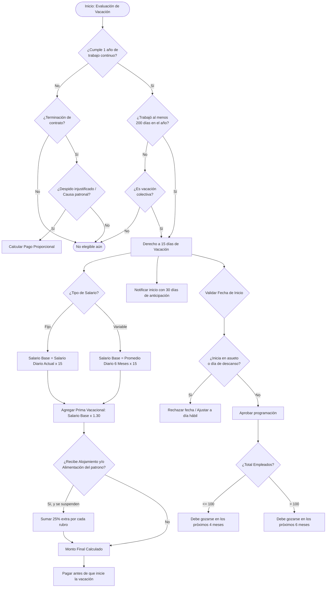

# **CAPÍTULO V: DE LA VACACIÓN ANUAL REMUNERADA**

*(Copia exacta del Código de Trabajo de El Salvador, Arts. 177 al 189\)*  
**Art. 177.-** Después de un año de trabajo continuo en la misma empresa o establecimiento o bajo la dependencia de un mismo patrono, los trabajadores tendrán derecho a un período de vacaciones cuya duración será de quince días, los cuales serán remunerados con una prestación equivalente al salario ordinario correspondiente a dicho lapso más un 30% del mismo.  
**Art. 178.-** Los días de asueto y de descanso semanal que quedaren comprendidos dentro del período de vacaciones, no prolongarán la duración de éstas; pero las vacaciones no podrán iniciarse en tales dias. Los descansos semanales compensatorios no podrán incluirse dentro del período de vacaciones.  
**Art. 179.-** Los años de trabajo continuo se contarán a partir de la fecha en que el trabajador comenzó a prestar sus servicios al patrono y vencerán en la fecha correspondiente de cada uno de los años posteriores.  
**Art. 180.-** Todo trabajador, para tener derecho a vacaciones, deberá acreditar un mínimo de doscientos días trabajados en el año, aunque en el contrato respectivo no se le exija trabajar todos los días de la semana, ni se le exija trabajar en cada día el máximo de horas ordinarias.  
**Art. 181.-** Se entenderá que la continuidad del trabajo no se interrumpe en aquellos casos en que se suspende el contrato de trabajo, pero los días que durare la suspensión no se computarán como días trabajados para los efectos del artículo anterior.  
**Art. 182.-** El patrono debe señalar la época en que el trabajador ha de gozar las vacaciones y notificarle la fecha de iniciación de ellas, con treinta días de anticipación por lo menos.  
Los plazos dentro de los cuales el trabajador deberá gozar de sus vacaciones, serán de cuatro meses si el número de trabajadores al servicio del patrono no excediere de ciento; y de seis meses, si el número de trabajadores fuere mayor de ciento; ambos plazos contados a partir de la fecha en que el trabajador complete el año de servicio.  
**Art. 183.-** Para calcular la remuneración que el trabajador debe recibir en concepto de prestación por vacaciones, se tomará en cuenta:  
1º) El salario básico que devengue a la fecha en que deba gozar de ellas, cuando el salario hubiere sido estipulado por unidad de tiempo: y,  
2º) El salario básico que resulte de dividir los salarios ordinarios que el trabajador haya devengado durante los seis meses anteriores a la fecha en que deba gozar de ellas, entre el número de días laborables comprendidos en dicho período, cuando se trate de cualquier otra forma de estipulación del salario.  
**Art. 184.-** Si en virtud del contrato de trabajo o por las normas de este Código, el patrono proporcionare al trabajador alojamiento, alimentación o ambas a la vez, deberá aumentarse la remuneración de las vacaciones en un 25% por cada una de ellas, siempre que durante éstas se interrumpan aquéllas.  
**Art. 185.-** La remuneración en concepto de vacaciones debe pagarse inmediatamente antes de que el trabajador empiece a gozarlas y cubrirá todos los días que quedaren comprendidos entre la fecha en que se va de vacaciones y aquéllas en que deba volver al trabajo.  
**Art. 186.-** DEROGADO. (8)  
**Art. 187.-** Cuando se declare terminado un contrato de trabajo con responsabilidad para el patrono, o cuando el trabajador fuere despedido de hecho sin causa legal, tendrá derecho a que se le pague la remuneración de los días que, de manera proporcional al tiempo trabajado, le correspondan en concepto de vacaciones. Pero si ya hubiere terminado el año continuo de servicio, aunque el contrato terminare sin responsabilidad para el patrono, éste deberá pagar al trabajador la retribución a que tiene derecho en concepto de vacaciones.  
**Art. 188.-** Se prohíbe compensar las vacaciones en dinero o en especie. Asimismo se prohíbe fraccionar o acumular los períodos de vacaciones; y a la obligación del patrono de darlas, corresponde la del trabajador de tomarlas.  
**Art. 189.-** El patrono podrá disponer que todo el personal de la empresa o establecimiento, disfrute colectivamente, dentro de un mismo período, de la vacación anual remunerada. En tal caso no será necesario que el trabajador complete el año de servicio que exige el Art. 177, ni los doscientos días de que habla el Art. 180, ni tendrá efecto lo dispuesto en el Art. 186\.  
También podrá el patrono, de acuerdo con la mayoría de trabajadores de la empresa o establecimiento, fraccionar las vacaciones en dos o más períodos dentro del año de trabajo. Si fueren dos, cada período deberá durar diez días por lo menos y, si fueren tres o más, siete días como mínimo.

# **Lógica de Negocio para Programadores (Sistema de Nómina/RRHH)**

## **1\. Reglas de Elegibilidad (Validaciones)**

* **Regla de Antigüedad (Art. 177, 179):** fecha\_actual \>= fecha\_contratacion \+ 1\_año. Se renueva anualmente.  
* **Regla de Días Trabajados (Art. 180, 181):** dias\_efectivamente\_trabajados \>= 200 dentro del año evaluado. (Días de suspensión de contrato *no* suman al contador de los 200 días).  
* **Excepción Colectiva (Art. 189):** Si es *Vacación Colectiva*, omitir validaciones de "1 año" y "200 días".  
* **Terminación de Contrato (Art. 187):** \- Si despido \== injustificado OR responsabilidad \== patrono ANTES del año: Calcular pago proporcional al tiempo trabajado.  
  * Si tiempo\_trabajado \>= 1\_año y no se ha gozado, PAGAR completo en finiquito sin importar la causa del despido.

## **2\. Reglas de Fechas y Programación**

* **Duración:** Estándar de 15 días calendario (Art. 177). No se suman días extra si hay asuetos o fines de semana de por medio (Art. 178).  
* **Restricción de Inicio:** La fecha de inicio NO puede caer en día de asueto o día de descanso semanal.  
* **Fraccionamiento (Art. 188, 189):** Por defecto fraccionamiento \= false. Si hay acuerdo mutuo:  
  * 2 fracciones \-\> min\_dias\_por\_fraccion \>= 10  
  * 3+ fracciones \-\> min\_dias\_por\_fraccion \>= 7  
* **Ventana de Goce (Art. 182):**  
  * Si total\_empleados \<= 100: Limite es fecha\_aniversario \+ 4\_meses.  
  * Si total\_empleados \> 100: Limite es fecha\_aniversario \+ 6\_meses.  
* **Notificación:** El sistema debe alertar/generar notificación 30 días antes de la fecha programada de inicio.

## **3\. Lógica de Cálculo y Pago**

* **Fórmula Base (Art. 177):** Monto\_Vacaciones \= Salario\_15\_Dias \* 1.30  
* **Cálculo de Salario\_15\_Dias (Art. 183):**  
  * *Salario Fijo:* Salario\_Diario\_Actual \* 15  
  * *Salario Variable (comisiones, destajo, etc.):* (Total\_Ingreso\_Ordinario\_Ultimos\_6\_Meses / Dias\_Laborables\_En\_6\_Meses) \* 15  
* **Prestaciones Adicionales (Art. 184):**  
  * Si recibe\_alojamiento \== true AND se\_interrumpe \== true: Adicional\_Alojamiento \= Monto\_Vacaciones \* 0.25  
  * Si recibe\_alimentacion \== true AND se\_interrumpe \== true: Adicional\_Alimentacion \= Monto\_Vacaciones \* 0.25  
  * Monto\_Final \= Monto\_Vacaciones \+ Adicional\_Alojamiento \+ Adicional\_Alimentacion  
* **Momento de Pago (Art. 185):** Generar orden de pago para el día hábil inmediato anterior a la fecha de inicio de las vacaciones.

# **Ejemplo**

El artículo menciona que el trabajador debe recibir:

10. El salario ordinario de esos 15 días (que equivale al **100%** de su salario base).  
11. **Más un 30%** adicional de ese mismo salario (lo que comúnmente se conoce como prima vacacional).

Si sumamos ambos porcentajes (100% \+ 30%), el trabajador debe recibir el **130%** de su salario de 15 días. Expresado en números decimales para programar o calcular en una fórmula, el 130% se escribe como **1.30**.  
**Veamos un ejemplo práctico:**  
Imagina que el salario de un trabajador por esos 15 días es de **$300.00**.

* **Paso a paso:**  
  * Salario base de 15 días \= $300.00  
  * Bono del 30% ($300.00 \* 0.30) \= $90.00  
  * Total a pagar ($300.00 \+ $90.00) \= **$390.00**  
* **Usando el atajo del 1.30:**  
  * Total a pagar \= $300.00 \* **1.30** \= **$390.00**

De ahí sale ese número en la fórmula. Es simplemente la manera más rápida y directa de programar "el salario base más su treinta por ciento".

# **Diagrama de Flujo (Mermaid)**

# **4. Implementacion Tecnica en el Sistema (v2)**

La logica de negocio de las vacaciones del Codigo de Trabajo (Arts. 177 - 189) se ha unificado en el sistema y se asocia a un modulo de programacion conciliada de vacaciones:

### A. Base de Datos:
Se agrego la columna `mes_vacaciones` de tipo `INT DEFAULT NULL` a la tabla `empleados` para almacenar el mes del año (1 al 12) conciliado de mutuo acuerdo entre la empresa y el colaborador para el goce y pago de sus vacaciones.

### B. Backend:
1. **Servicio de Calculo ([v2_payrollService.js](file:///home/bladimir/Documentos/02%20PROYECTOS/Proyecto%20RHU/rrhhu-comsertel/backend/services/v2_payrollService.js#L202-L225))**:
   Se simplifico el metodo `calcularVacaciones` eliminando cualquier referencia o regla especial del mes de diciembre. Ahora calcula la vacacion de ley de forma directa para todos los meses y empleados elegibles:
   $$\text{Monto Vacaciones} = \frac{\text{Salario Base}}{2.0} \times 1.30$$
2. **Endpoint de Programacion ([v2_empleadosController.js](file:///home/bladimir/Documentos/02%20PROYECTOS/Proyecto%20RHU/rrhhu-comsertel/backend/controllers/v2_empleadosController.js#L214-L253))**:
   Se creo la funcion `programarVacacion` y se registro la ruta `PUT /api/v2/empleados/:id/vacacion-mes` para guardar o actualizar el mes programado de vacaciones del colaborador en la base de datos.
3. **Controlador de Planillas ([v2_planillasController.js](file:///home/bladimir/Documentos/02%20PROYECTOS/Proyecto%20RHU/rrhhu-comsertel/backend/controllers/v2_planillasController.js#L248-L253))**:
   Se modifico el endpoint de generar planilla para seleccionar la columna `mes_vacaciones` de los empleados activos y automatizar la asignacion del pago. Si el `mes_vacaciones` programado coincide con el mes de la planilla que se esta calculando, el motor ejecuta el calculo del 130% de vacaciones de ley en automatico y lo asigna a la boleta. De lo contrario, se asigna `$0.00`.

### C. Frontend:
1. **Modulo de Programacion de Vacaciones ([V2_ContenedorProgramacionVacaciones.jsx](file:///home/bladimir/Documentos/02%20PROYECTOS/Proyecto%20RHU/rrhhu-comsertel/frontend/app-react/src/components/V2_ContenedorProgramacionVacaciones.jsx))**:
   Nueva interfaz de usuario que clasifica al personal en dos pestañas:
   * **Personal Apto**: Lista a los empleados con antigüedad de al menos 1 año continuo (Art. 177) y muestra un selector para calendarizar el mes de goce y pago (1 al 12). Al seleccionar un mes, se guarda de forma automatica en la base de datos mediante un Toast de SweetAlert2.
   * **Aun no elegibles**: Lista a los empleados que no cumplen con los requisitos de antigüedad o estan inactivos.
2. **Generacion de Planillas ([V2_ContenedorPlanilla.jsx](file:///home/bladimir/Documentos/02%20PROYECTOS/Proyecto%20RHU/rrhhu-comsertel/frontend/app-react/src/components/V2_ContenedorPlanilla.jsx#L1210-L1225))**:
   Se eliminaron los checkboxes de la columna "Vacaciones a Pagar". Al seleccionar el mes de la planilla, el componente de forma automatica precalcula y muestra en la grilla el monto de vacaciones para aquellos colaboradores cuya calendarizacion conciliada coincide con el mes en curso de la planilla.
3. **Reporte Consolidado ([V2_ContenedorPlanillaFormato.jsx](file:///home/bladimir/Documentos/02%20PROYECTOS/Proyecto%20RHU/rrhhu-comsertel/frontend/app-react/src/components/V2_ContenedorPlanillaFormato.jsx#L190-L200))**:
   Se simplifico el desglose de vacaciones a la regla general de ley: el "Monto de vacaciones" equivale al salario base de 15 dias y la "Bonificacion de vacaciones" equivale al recargo del 30% de la prima vacacional.

